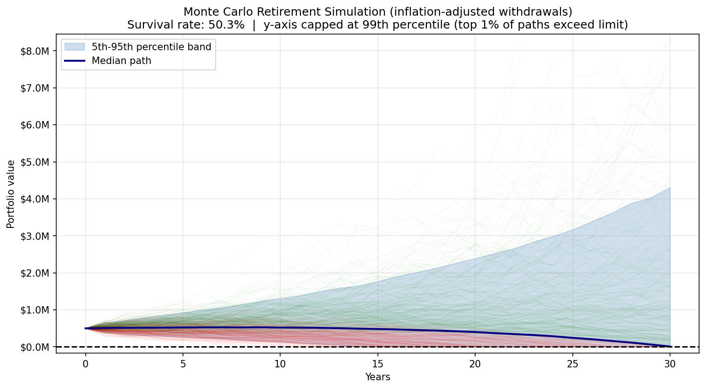
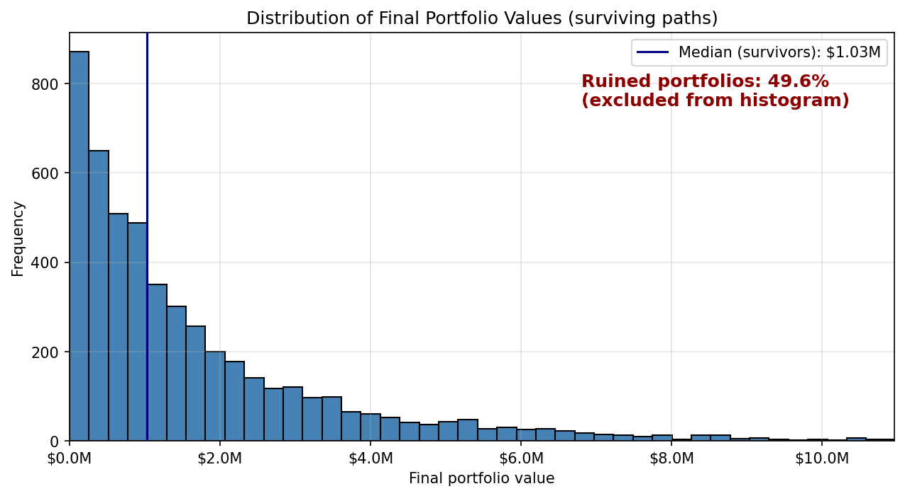
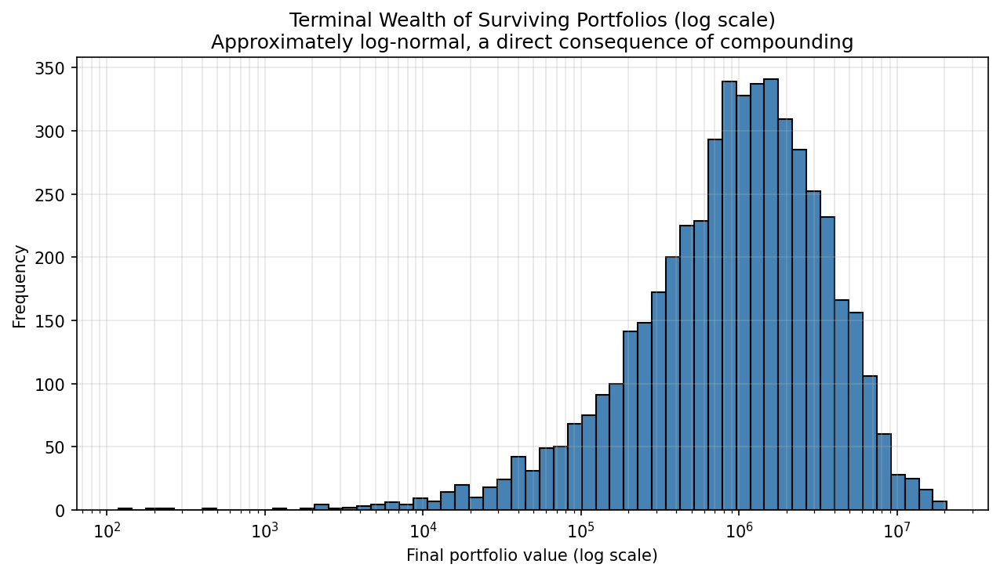

# Monte Carlo Retirement Simulation

A Python simulation I built to answer a simple question: if someone retires with $500,000 and withdraws $25,000 a year, how likely is it that their money lasts 30 years?

The honest answer turned out to be "it depends on one assumption most people forget."

## The main finding

When withdrawals stay fixed at $25,000 every year, the portfolio survives in about **80.3%** of the 10,000 simulated scenarios. But nobody spends the same amount for 30 years: prices rise, so withdrawals should rise too. Once I adjusted withdrawals for 3% annual inflation, the survival rate dropped to **50.3%**.

One line of code, thirty percentage points. That gap is the whole point of the project.

## What the simulation shows



Each line is one possible 30-year "life" of the portfolio (green survived, red went broke). The dark line is the median scenario and the shaded band covers 90% of the outcomes. What surprised me most is how wide that band gets: same starting point, same strategy, completely different endings depending on the order in which good and bad years arrive.



This is where the surviving portfolios end up after 30 years. The distribution is heavily skewed: most survivors finish with modest amounts, while a few lucky paths end with several million. I excluded the ruined portfolios (49.7%) from the histogram because a single giant bar at zero was hiding the shape of everything else.



The same data on a logarithmic scale. The skewed distribution becomes roughly bell-shaped, which makes sense: returns compound multiplicatively, so terminal wealth tends toward a log-normal distribution. I had read this in theory; seeing it come out of my own simulation was a nice moment.

## Assumptions (all debatable)

- Initial portfolio: $500,000
- Withdrawal: $25,000/year, growing 3% annually with inflation
- Expected return: 7% per year, volatility 15% (roughly a diversified equity-heavy portfolio)
- Returns are drawn from a normal distribution
- Horizon: 30 years, 10,000 simulations, fixed seed (42) so results are reproducible

## How to run it

```bash
pip install -r requirements.txt
python monte_carlo_retirement.py
```

The script prints the survival rate and wealth percentiles, and saves the three charts to `images/`.

To test the no-inflation case, change `inflation=0.03` to `inflation=0` in the parameters of `simulate_retirement()`.

## Limitations and what I'd like to add

The normal distribution understates extreme market events (real returns have fatter tails), returns here are independent year to year, and everything is in nominal terms. Reasonable next steps: bootstrap sampling from historical returns, a Student's t distribution for fat tails, and testing withdrawal rules that adapt to portfolio performance instead of ignoring it.

---

*Built with Python, NumPy and Matplotlib, as part of my learning process in quantitative finance. Feedback is welcome.*
